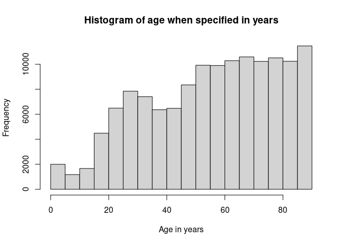
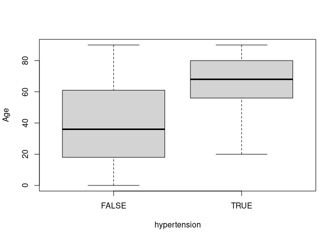
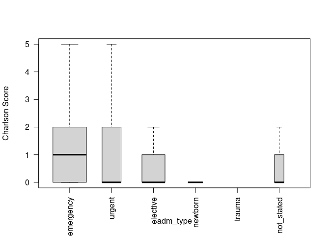

<!-- 
rmarkdown::render("README.Rmd")
#-->

# nhds

<!-- badges: start -->

[](https://cran.r-project.org/package=nhds)
[](https://travis-ci.org/jackwasey/nhds)
[](https://ci.appveyor.com/project/jackwasey/nhds)
<!-- badges: end -->

ICD-9 and ICD-10 definitions from the United States Center for Medicare
and Medicaid Services (CMS) are included in this package. A function is
provided to extract the WHO ICD-10 definitions from the public
interface, but the data themselves may not currently be redistributed.
The function ‘fetch\_icd10who2016()’ should be run once after installing
this package. There are diagnostic and procedure codes, and lists of the
chapter and sub-chapter headings and the ranges of ICD codes they
encompass. There are also two sets of sample patient data with ICD-9 and
ICD-10 codes representing real patients and spanning common structures
of patient data. These data are used by the ‘icd’ package for finding
comorbidities and working with ICD codes.

See documentation for the [R CRAN package:
icd](https://jackwasey.github.io/icd/) for how to use this data. See
also the [R CRAN package:
icd.data](https://cran.r-project.org/package=icd.data).

# Examples

``` r
nhds2010$hypertension <- icd::comorbid_ahrq(nhds2010)[, "HTN"]
nhds2010$charlson <- icd::charlson(nhds2010)
hist(nhds2010[nhds2010$age_unit == "years", "age"],
     main = "Histogram of age when specified in years", 
     xlab = "Age in years"
     )
```



``` r
boxplot(age ~ hypertension, 
        data = nhds2010,
        outline = FALSE,
        ylab = "Age")
```



``` r
boxplot(charlson ~ adm_type, 
        data = nhds2010,
        las = 2, 
        varwidth = TRUE, 
        outline = FALSE,
        ylab = "Charlson Score"
        )
```


